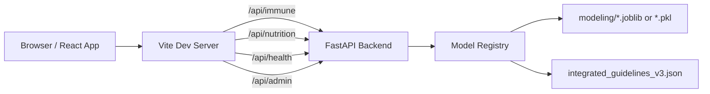

# Webservice Project

요양원 운영을 위한 프론트엔드(Vite + React)와 모델 추론 백엔드(FastAPI)를 함께 사용하는 프로젝트입니다.

현재 구현 기준으로 로그인/권한, 대시보드, 감염 취약성 관리, 영양 관리, 템플릿 관리, 원장 관리 페이지가 포함되어 있습니다.

## Important Notice

현재 로그인 계정(`sub/1234`, `mana/0000`)은 데모/개발용 하드코딩 값입니다.  
실운영 환경에서는 그대로 사용하면 안 되며, 인증 서버 기반(JWT/Session/SSO)으로 교체해야 합니다.

## Tech Stack

- Frontend: `React 18`, `TypeScript`, `Vite 5`, `Tailwind CSS`, `Radix UI`
- Backend: `FastAPI`, `Pydantic`, `joblib`
- Model files: `modeling/*.pkl`, `modeling/*.ipynb`, `modeling/sample_*.csv`

## Main Features

### 1) 로그인/권한

- 최초 접속 시 로그인 페이지가 먼저 표시됩니다.
- 계정
- `요양원 직원`: `sub / 1234`
- `요양원장`: `mana / 0000`
- 권한
- 직원 로그인: 첫 화면 `Dashboard`, `Management` 메뉴 비노출
- 원장 로그인: 첫 화면 `Management`, 전체 메뉴 접근 가능
- 로그아웃 시 로그인 화면으로 복귀합니다.

### 2) 페이지 구성

- `Dashboard`: 시설 요약 지표, 병실 단면도, 공지사항 위젯
- `Immune`: 감염 취약성 관리, 이용자 상세/조치/CSV 연동
- `Nutrition`: 영양소 상태, 추천 영양소/음식, 예측 엔진, 검색
- `Template`: 템플릿 편집/토큰/채널/미리보기
- `Management`: 요양원 원장 관리 센터

### 3) 공지사항 데이터 공통화

- 대시보드와 원장 관리 페이지 공지사항은 동일한 공통 데이터(`components/data/facilityNotices.ts`)를 사용합니다.

### 4) 모델 연동/폴백

- 프론트는 `/api/immune`, `/api/nutrition`, `/api/health`, `/api/admin` 요청을 백엔드로 프록시합니다.
- 백엔드 모델 아티팩트가 없거나 로드에 실패해도 서버는 유지되며 폴백 응답으로 UI가 깨지지 않게 동작합니다.

## Run (Windows)

### Frontend only

```bash
npm install
npm run dev
```

기본 개발 주소: `http://127.0.0.1:5173`

### Full stack (Frontend + Backend)

#### 1) Backend

```bash
cd backend
python -m venv .venv
.venv\Scripts\activate
pip install -r requirements.txt
uvicorn app.main:app --reload --host 0.0.0.0 --port 8000
```

백엔드 주소: `http://127.0.0.1:8000`

#### 2) Frontend

프로젝트 루트(`web/`)에서:

```bash
npm run dev
```

필요 시 백엔드 타깃 변경:

```bash
set VITE_BACKEND_URL=http://127.0.0.1:8000
npm run dev
```

## Architecture



## Screens

- 주요 화면: `Dashboard`, `Immune`, `Nutrition`, `Template`, `Management`
- 공지사항 데이터는 `components/data/facilityNotices.ts`를 공통 사용
- 로그인/권한 분기 진입점은 `App.tsx`

## API Summary

- `GET /api/health`: 백엔드 상태 및 모델 로딩 상태
- `POST /api/immune/predict`
- `POST /api/immune/predict/batch`
- `POST /api/nutrition/simulate`
- `POST /api/admin/reload-models`

백엔드 엔트리 포인트: `backend/app/main.py`

## Model Artifact Paths

백엔드는 아래 경로를 우선 탐색합니다.

- `modeling/artifacts/divs_immune_model_v7.joblib`
- `modeling/artifacts/albumin_predictor_improved.joblib`
- `modeling/artifacts/integrated_guidelines_v3.json`

추가로 `modeling/` 루트의 fallback 경로(`.joblib`, `.pkl`)도 탐색합니다.

## Pillyze Search Proxy (Dev)

- 개발 서버에서만 `vite.config.ts`의 미들웨어가 `/api/pillyze/search`를 처리합니다.
- 운영 배포 시에는 별도 서버 API 구성이 필요합니다.

## Project Structure

- `App.tsx`: 로그인/권한, 섹션 라우팅의 진입점
- `components/`: 페이지/공통 UI
- `components/data/`: 공통 데이터(이용자, 공지사항 등)
- `components/api/`: 프론트 API 유틸
- `components/modeling/`: CSV 추론/저장소 유틸
- `backend/`: FastAPI 모델 백엔드
- `modeling/`: 모델 파일/노트북/샘플 CSV
- `styles/`: 글로벌 스타일
- `public/`: 정적 리소스

## Build

```bash
npm run build
```

- 산출물은 `dist/`에 생성됩니다.
- `dist/`는 생성물 폴더이므로 Git 관리 대상에서 제외합니다.

## Notes

- 현재 로그인 계정은 데모용 하드코딩 값입니다(`App.tsx`).
- 실제 운영 시 인증 서버/JWT/세션 저장소 방식으로 교체하는 것을 권장합니다.
